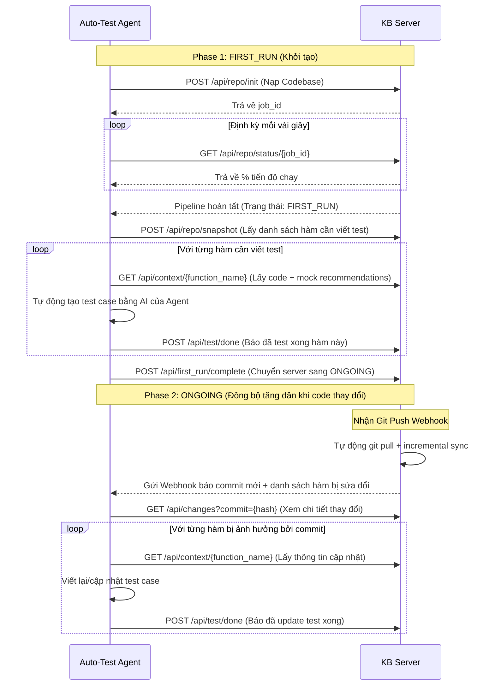

# Hướng dẫn Kết nối API (Dành cho Client / Dev Teams khác) 🔌

Chào mừng bạn đến với hệ thống **GraphRAG Knowledge Base API Server**. Hệ thống này cung cấp toàn bộ dữ liệu cấu trúc code, sơ đồ phụ thuộc (Call Graph), lịch sử thay đổi Git và đặc tả kiểm thử (AI Test Recommendations) của dự án.

Tài liệu này hướng dẫn cách kết nối và gọi các endpoint từ client (Auto-Test Agent hoặc mã nguồn của bạn).

---

## 0. Tổng quan từ A đến Z cho người mới bắt đầu 📖

### 1. Hệ thống này là gì?
Hệ thống này là một **Cơ sở tri thức (Knowledge Base) thông minh** chạy ngầm dưới dạng API Server. Nó tự động phân tích mã nguồn và lịch sử Git của bạn, sau đó dùng AI để sinh ra một bản đồ chi tiết của toàn bộ codebase.

Bản đồ này không chỉ lưu trữ code thô, mà còn liên kết:
* **Hàm A gọi hàm B** (Call Graph) như thế nào.
* **Commit Git nào đã sửa hàm nào**.
* **Đặc tả kiểm thử bằng AI**: Với mỗi hàm, AI đã phân tích trước xem nó hoạt động thế nào, có tham số gì, những lỗi (edge-cases) nào dễ xảy ra và nên viết Mock ra sao.

### 2. Tại sao bạn cần nó?
Nếu bạn đang viết một **Tác nhân tự động (Auto-Test Agent)** để tự sinh test case (Unit Test):
* **Không cần tự đọc toàn bộ codebase**: codebase có hàng trăm file, Agent của bạn không thể tự đọc hết vì quá giới hạn token của LLM. Hệ thống này cung cấp API để bạn hỏi thông tin của đúng hàm cần test cùng các mối quan hệ liên quan.
* **Biết hàm nào cần test trước (Độ ưu tiên)**: Hệ thống tính toán sẵn `priority_score` (Hàm nào phức tạp, có nhiều hàm khác gọi tới và hay bị sửa đổi gần đây sẽ có điểm ưu tiên cao để viết test trước).
* **Đồng bộ tự động**: Khi lập trình viên push code mới, hệ thống tự động cập nhật bản đồ và báo cho Agent của bạn biết những hàm nào vừa bị thay đổi cần cập nhật test case.

### 3. Quy trình sử dụng từ số 0 (Dành cho bạn)
1. **Nhận thông tin**: Xin Admin địa chỉ IP và API Key để truy cập.
2. **Kích hoạt nạp code**: Gọi API `/api/repo/init` truyền link Git dự án của bạn vào. Server sẽ tự động tải code về phân tích.
3. **Theo dõi**: Chờ server phân tích xong (Theo dõi tiến độ qua API status).
4. **Lấy danh sách cần test**: Gọi `/api/repo/snapshot` để lấy danh sách các hàm cần viết test kèm điểm ưu tiên.
5. **Viết test case**: Với mỗi hàm, gọi `/api/context/{tên_hàm}` để lấy đặc tả gợi ý viết test, sinh test case tương ứng và đẩy test case lên repo.
6. **Báo cáo hoàn thành**: Gọi API `/api/test/done` khi viết xong test cho mỗi hàm.

---

## 1. Thông tin Kết nối cơ bản
* **Địa chỉ Server (Base URL)**: `https://suffice-unselfish-shrouded.ngrok-free.dev`
* **Xác thực (Authentication)**: Đính kèm API Key trong Header của mọi request:
  * Key: `X-API-Key`
  * Value: `test-key-123`
* **Tài liệu API tương tác (Swagger UI)**: Truy cập `https://suffice-unselfish-shrouded.ngrok-free.dev/docs` bằng trình duyệt để xem và chạy thử trực tiếp.

---

## 2. Quy trình làm việc cốt lõi (Workflow)



---

## 3. Danh sách đầy đủ 10 API Endpoints

### 3.1 Nạp/Khởi tạo dự án
* **Endpoint**: `POST /api/repo/init`
* **Mô tả**: Bắt đầu nhân bản và phân tích codebase bất đồng bộ.
* **Payload**:
  ```json
  {
    "repo_url": "https://github.com/example/my-project.git",
    "language": "python"
  }
  ```
* **Phản hồi**: `{"job_id": "job-xxxx", "status": "queued"}`

### 3.2 Kiểm tra tiến độ nạp code
* **Endpoint**: `GET /api/repo/status/{job_id}`
* **Mô tả**: Dùng để poll liên tục lấy tiến độ phân tích (progress 0-100%).
* **Phản hồi**:
  ```json
  {
    "job_id": "job-xxxx",
    "step": "3/9",
    "progress": 33,
    "status": "running",
    "message": "Parsing codebase (AST, docs, git)..."
  }
  ```

### 3.3 Lấy danh sách hàm & độ ưu tiên (Snapshot)
* **Endpoint**: `POST /api/repo/snapshot`
* **Mô tả**: Trả về toàn bộ các hàm được gom nhóm theo Community kèm `priority_score` (tính toán dựa trên độ phức tạp, số liên kết gọi hàm và tần suất sửa đổi trong Git).
* **Phản hồi**:
  ```json
  {
    "total": 125,
    "communities": [
      {
        "id": 1,
        "name": "Auth Service",
        "summary": "Handles user login and tokens...",
        "functions": [
          {
            "name": "generate_token",
            "file": "auth.py",
            "complexity": 7,
            "priority_score": 18.2,
            "has_test": false
          }
        ]
      }
    ]
  }
  ```

### 3.4 Báo cáo hoàn thành giai đoạn FIRST_RUN
* **Endpoint**: `POST /api/first_run/complete`
* **Mô tả**: Sau khi Agent của bạn hoàn tất việc tạo và chạy test cho toàn bộ snapshot ở giai đoạn đầu, hãy gọi endpoint này để chuyển server sang chế độ giám sát `ONGOING`.
* **Payload**:
  ```json
  {
    "generated_count": 125
  }
  ```
* **Phản hồi**: `{"mode": "ONGOING", "flushed_commits": 0}`

### 3.5 Tra cứu các hàm thay đổi theo Commit
* **Endpoint**: `GET /api/changes?commit={commit_hash}`
* **Mô tả**: Hoạt động trong chế độ `ONGOING`. Trả về danh sách hàm bị sửa đổi bởi một commit cụ thể kèm mức độ rủi ro (`risk_level`: "high", "medium", "low").
* **Phản hồi**:
  ```json
  {
    "commit": "a1b2c3d4",
    "changed_functions": [
      {
        "name": "generate_token",
        "file": "auth.py",
        "class_name": null,
        "complexity": 7,
        "has_test": true
      }
    ],
    "affected_services": [
      {"id": 1, "name": "Auth Service"}
    ],
    "risk_level": "medium"
  }
  ```

### 3.6 Lấy ngữ cảnh chi tiết của một hàm (Context Query)
* **Endpoint**: `GET /api/context/{function_name}`
* **Mô tả**: Lấy mã nguồn, đặc tả kiểm thử, cấu trúc tham số đầu vào/ra, các case biên và sơ đồ gọi hàm (gồm hàm gọi đi và hàm gọi tới nó).
* **Phản hồi**:
  ```json
  {
    "function": {
      "name": "generate_token",
      "raw_code": "def generate_token(user_id):\n...",
      "how_it_works": "Generates a JWT token for the user...",
      "input_spec": "user_id: string, non-nullable...",
      "edge_cases": ["invalid user_id", "expired key"],
      "test_recommendations": [
        {"type": "mock", "target": "jwt.encode", "reason": "Avoid crypto latency"}
      ]
    },
    "calls_outside": [{"name": "db_query", "type": "Function"}],
    "called_by": [{"name": "login_user", "type": "Function"}]
  }
  ```

### 3.7 Liệt kê danh sách hàm
* **Endpoint**: `GET /api/functions`
* **Mô tả**: Liệt kê các hàm trong DB, có thể lọc nhanh theo việc đã có test case hay chưa.
* **Tham số**: `has_test` (boolean, optional), `limit` (integer, optional)
* **Phản hồi**: Mảng danh sách các hàm kèm meta thô.

### 3.8 Đánh dấu hàm đã có test case
* **Endpoint**: `POST /api/test/done`
* **Mô tả**: Ghi nhận một hàm đã có test case hoạt động thành công (`has_test = true`).
* **Payload**:
  ```json
  {
    "function_name": "generate_token",
    "file": "auth.py"
  }
  ```
* **Phản hồi**: `{"status": "ok", "function": "generate_token", "has_test": true}`

### 3.9 Kích hoạt đồng bộ Git Webhook
* **Endpoint**: `POST /api/git-sync`
* **Mô tả**: Endpoint webhook dùng để liên kết với GitHub/GitLab. Khi dev push code mới, Git Server sẽ POST vào đây để kích hoạt quy trình đồng bộ hóa tăng dần (incremental sync) trong background.
* **Phản hồi**: `{"status": "sync_started", "codebase_path": "..."}`

### 3.10 Kiểm tra sức khỏe Server
* **Endpoint**: `GET /api/health`
* **Mô tả**: Endpoint công khai (không cần API Key) dùng để kiểm tra trạng thái hoạt động của server và kết nối cơ sở dữ liệu Neo4j.
* **Phản hồi**:
  ```json
  {
    "status": "ok",
    "mode": "IDLE",
    "total_functions": 0,
    "queued_commits": 0,
    "last_sync": null,
    "current_job": null,
    "codebase_path": null,
    "neo4j": "connected"
  }
  ```

---

## 4. Ví dụ Code Client (Python & Javascript)

### Python
```python
import requests

BASE_URL = "http://192.168.1.15:8080"  # Thay bằng IP máy chủ thực tế
HEADERS = {
    "X-API-Key": "your-secret-api-key-here",
    "Content-Type": "application/json"
}

# 1. Lấy snapshot các hàm cần test
response = requests.post(f"{BASE_URL}/api/repo/snapshot", headers=HEADERS)
snapshot = response.json()
print(f"Tổng số hàm: {snapshot['total']}")

# 2. Lấy context chi tiết của hàm 'generate_token'
func_name = "generate_token"
context_resp = requests.get(f"{BASE_URL}/api/context/{func_name}", headers=HEADERS)
context = context_resp.json()

print("Mã nguồn:")
print(context["function"]["raw_code"])
print("Đặc tả Mocking:")
print(context["function"]["test_recommendations"])
```

### Javascript / Node.js (Fetch API)
```javascript
const BASE_URL = "http://192.168.1.15:8080";
const HEADERS = {
  "X-API-Key": "your-secret-api-key-here",
  "Content-Type": "application/json"
};

// Đánh dấu đã test xong một hàm
async function markAsTested(functionName, filePath) {
  const response = await fetch(`${BASE_URL}/api/test/done`, {
    method: "POST",
    headers: HEADERS,
    body: JSON.stringify({
      function_name: functionName,
      file: filePath
    })
  });
  const result = await response.json();
  console.log("Cập nhật trạng thái:", result.status);
}
```
