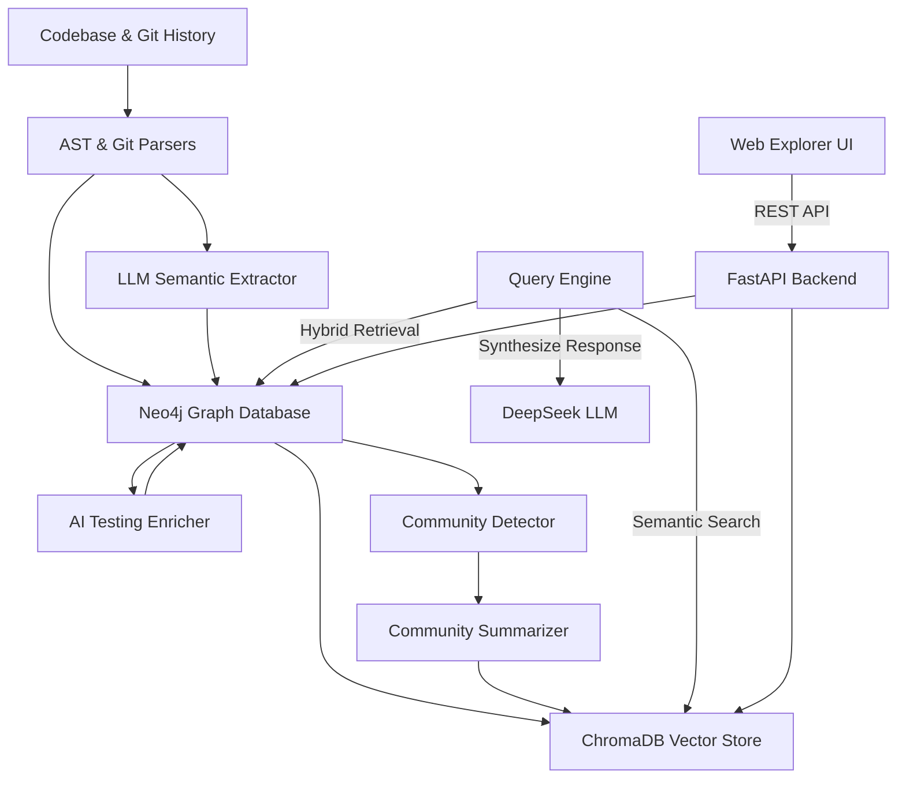

# System Architecture: GraphRAG for Codebases

This document outlines the architecture, data flow, and components of the GraphRAG (Graph-based Retrieval-Augmented Generation) system optimized for local codebases and autonomous testing agents.

---

## 1. High-Level Architecture Overview

The system parses codebases, builds a hybrid Knowledge Graph (combining AST syntax nodes, git commit history, and LLM-extracted semantic features), indexes them semantically, and exposes a visual explorer and a retrieval engine.



---

## 2. Key Components

### 2.1 Workspace & Database Isolation
The system supports multi-project isolation managed through `.env` configurations.
- **Project Identifier (`PROJECT_NAME`)**: Separates data storages.
- **Neo4j Storage**: Mapped via bind mounts to `./data/${PROJECT_NAME}/neo4j/data` to keep databases isolated.
- **ChromaDB Storage**: Placed dynamically inside `./data/${PROJECT_NAME}/chroma_db` to separate vector spaces.

### 2.2 Upgraded AST Code Parser (`parsers/ast_parser.py`)
- **Engine**: Tree-Sitter parsing Python (`.py`), JavaScript (`.js`/`.jsx`), and TypeScript (`.ts`/`.tsx`) files.
- **Nodes**: Maps file structures to `Class` and `Function` nodes.
- **Relations**: Scans function call syntax inside bodies to create `CALLS` relations between nodes.
- **Rich Static Metadata Extraction**: For each function and class, the parser statically extracts:
  - `is_async` (boolean flag)
  - `visibility` (public, private, protected)
  - `inputs` (parameter list with names, type annotations, and default values serialized as JSON)
  - `output` (return type annotation)
  - `docstring` (comments or triple-quoted literals)
  - `raises` (exceptions raised/thrown inside the function body)
  - `complexity` (cyclomatic complexity score computed statically)
  - `annotations` (decorators applied to the node)

### 2.3 Incremental Synchronizer (`updater/`)
Avoids rebuilding the graph from scratch on every change:
- **File Watcher (`watcher.py`)**: A background service that listens to filesystem save events. It parses only the modified files and updates their AST nodes/relationships in Neo4j and ChromaDB instantly without calling LLMs.
- **Git Hook (`git_hook.py`)**: Installed in the target codebase (`.git/hooks/post-commit`). Automatically parses the latest git commit on commit events, extracting features and linking commit history to code nodes.

### 2.4 AI Testing Enricher (`extractors/testing_enricher.py`)
- Queries all user-defined functions in Neo4j and uses the LLM to generate high-value testing specifications:
  - `how_it_works`: Clear plain English summary of logic, side effects, and dependencies.
  - `input_spec`: Valid ranges, boundaries, and type constraints for parameters.
  - `output_spec`: Detailed returns under various conditions (null, error, etc.).
  - `edge_cases`: Boundary values and scenarios likely to cause bugs.
  - `test_recommendations`: Actionable steps on what to mock (databases, external APIs), what test cases to write (Happy/Error paths), and the shape of mock data.
- Stores these specifications directly back into the Neo4j `:Function` nodes.

### 2.5 Semantic Extractor & Community Manager (`extractors/`, `community/`)
- **LLM Extractor (`llm_extractor.py`)**: Leverages DeepSeek-V4 (via OpenRouter) to extract human-level abstractions (Concepts, Features, Risks, Decisions, Tasks) from raw code and commits.
- **Community Detector (`detector.py`)**: Clusters graph nodes into hierarchical communities using Neo4j APOC/Leiden algorithms.
- **Community Summarizer (`summarizer.py`)**: Summarizes the role of each community. It automatically bypasses LLM summarization for small communities (< 3 nodes) to minimize token consumption and runtime, and upserts summaries to ChromaDB in batches.

### 2.6 Hybrid Query Engine (`query/engine.py`)
Provides context for LLM answering:
1. **Vector Stage**: Search ChromaDB for the closest code nodes, features, and community summaries.
2. **Graph Stage**: Perform multi-hop Cypher queries in Neo4j starting from the vector matches to gather relational context (e.g. what calls what, what features depend on what code, and the detailed testing specifications of those nodes).
3. **Synthesis Stage**: Merges the retrieved context and feeds it to DeepSeek-V4 to generate a final answer.

### 2.7 Visualization & API (`visualization/`, `mcp/`)
- **Backend API**: A FastAPI server exposing endpoints for graph queries, search, node details, and community graphs.
- **Frontend Dashboard**: A React application using `react-force-graph-2d` and D3 Force layout. Includes edge filtering to prevent rendering crashes on dangling graph connections.
- **MCP Server**: Implements the Model Context Protocol (MCP), allowing external AI assistants (like Claude Desktop) to use this GraphRAG system as a tool server.

---

## 3. Database Schemas

### 3.1 Function Node Schema (`:Function`)
Stores syntactic and semantic context for a function or method.
- **`name`**: Function name.
- **`file`**: File path where the function is defined.
- **`start_line` / `end_line`**: Physical lines in code.
- **`raw_code`**: Up to 2000 characters of the function's source code.
- **`is_async`**: Boolean (true if async function).
- **`visibility`**: `"public"`, `"private"`, or `"protected"`.
- **`class_name`**: Name of the parent class (or null/blank if top-level).
- **`docstring`**: Statically extracted documentation.
- **`inputs`**: JSON array of parameter dictionaries `[{"name": "...", "type": "...", "default": "..."}]`.
- **`output`**: Return type annotation string.
- **`raises`**: JSON array of exception names thrown by this function.
- **`complexity`**: Cyclomatic complexity score (integer, starting at 1).
- **`annotations`**: JSON array of decorators/annotations.
- **`how_it_works`**: (AI-enriched) Functional summary.
- **`input_spec`**: (AI-enriched) Detailed parameter constraints.
- **`output_spec`**: (AI-enriched) Return type specifications.
- **`edge_cases`**: (AI-enriched) JSON array of boundary cases.
- **`test_recommendations`**: (AI-enriched) JSON array of mock suggestions and test cases.

### 3.2 Class Node Schema (`:Class`)
Stores structural information about a class.
- **`name`**: Class name.
- **`file`**: File path.
- **`start_line` / `end_line`**: Code bounds.
- **`raw_code`**: Definition of the class.
- **`visibility`**: `"public"` or `"private"`.
- **`docstring`**: Statically extracted class docstring.
- **`annotations`**: JSON array of class decorators.

---

## 4. Directory Structure

```text
D:\GraphRAG\
├── config.py                 # System configuration and environment loader
├── docker-compose.yml        # Multi-container orchestration (Neo4j, ChromaDB)
├── start_all.bat             # 1-Click launcher script for Windows developers
├── .env                      # Local environment configurations (ignored in git)
├── data/
│   └── <PROJECT_NAME>/       # Isolated storage directory per codebase
│       ├── neo4j/            # Neo4j database files
│       └── chroma_db/        # ChromaDB vector collections
├── parsers/                  # Code and Git history parsers (upgraded rich AST)
├── extractors/               # Entity extractors and AI Testing Enricher
├── community/                # Graph clustering and community summarization
├── query/                    # Hybrid search and context synthesis engine
├── updater/                  # Filesystem Watcher and Git Hooks
├── visualization/            # FastAPI Backend & React Frontend Dashboard
├── mcp/                      # Model Context Protocol TS/JS server
└── scratch/                  # Test scripts and development playground
```

---

## 5. Operational Workflows

### Starting the System
Double-click `start_all.bat` or run:
```powershell
.\start_all.bat
```
This boots up the databases in Docker, runs the FastAPI backend on port `8080`, launches the React explorer on port `5173`, and turns on the background file change watcher.

### Adding a New Project
1. Update `PROJECT_NAME` and `CODEBASE_PATH` in `.env`.
2. Run `python main.py` to index and enrich the new codebase.
3. Launch via `start_all.bat`.
