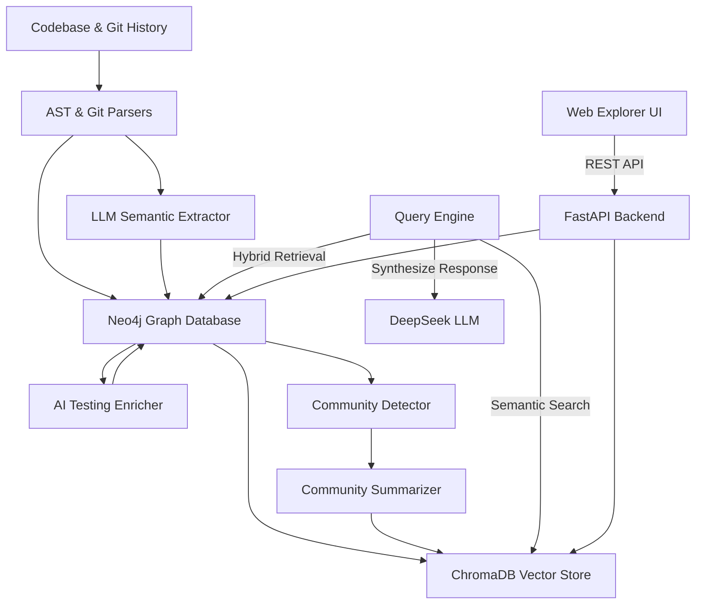

# System Architecture: GraphRAG for Codebases

This document outlines the architecture, data flow, and components of the GraphRAG (Graph-based Retrieval-Augmented Generation) system optimized for local codebases and autonomous testing agents.

---

## 1. High-Level Architecture Overview

The system parses codebases, builds a hybrid Knowledge Graph (combining AST syntax nodes, git commit history, and LLM-extracted semantic features), indexes them semantically, and exposes a visual explorer and a retrieval engine.



---

## 2. Key Components

### 2.1 Workspace & Database Isolation (Plug-and-Play)
The system supports zero-configuration codebase-level isolation.
- **Target Codebase (`CODEBASE_PATH`)**: The directory path of the project to analyze.
- **Data Folder (`.graphrag_data`)**: All database files (Neo4j, ChromaDB) and sync metadata are stored inside a hidden folder `.graphrag_data/` directly under the target codebase folder. This achieves complete isolation without requiring centralized storage in the tool directory.

### 2.2 Upgraded AST Code Parser (`parsers/ast_parser.py`)
- **Engine**: Tree-Sitter parsing Python (`.py`), JavaScript (`.js`/`.jsx`), and TypeScript (`.ts`/`.tsx`) files.
- **Nodes**: Maps file structures to `Class` and `Function` nodes.
- **Relations**: Scans function call syntax inside bodies to create `CALLS` relations between nodes.
- **Dynamic Module Import Tracking**: Tree-Sitter parser extracts module-level import statements (`import X`, `from X import Y`, relative imports) and records `File -[:IMPORTS]-> Module` and `Function -[:USES_EXTERNAL]-> Module` relationships.
- **Version-Aware Stdlib Detection**: Automatically detects Python standard library modules dynamically using `sys.stdlib_module_names` (for Python 3.10+), falling back to a static collection for older environments, ensuring highly accurate external vs standard library classification.
- **Coordinate & Anchor Extraction**: To prevent database size bloat, raw source code is no longer stored in the graph database. Instead, the parser extracts the physical line coordinates (`start_line` / `end_line`) and the `anchor` (the first line of the function/class, stripped) to resolve the code dynamically.
- **Rich Static Metadata Extraction**: For each function and class, the parser statically extracts:
  - `is_async` (boolean flag)
  - `visibility` (public, private, protected)
  - `inputs` (parameter list with names, type annotations, and default values serialized as JSON)
  - `output` (return type annotation)
  - `docstring` (comments or triple-quoted literals)
  - `raises` (exceptions raised/thrown inside the function body)
  - `complexity` (cyclomatic complexity score computed statically)
  - `annotations` (decorators applied to the node)

### 2.3 Incremental Synchronizer (`updater/` & `initialize_graph.py`)
Avoids rebuilding the graph from scratch on every change:
- **File Watcher (`watcher.py`)**: A background service that listens to filesystem save events. It parses only the modified files and updates their AST nodes/relationships in Neo4j and ChromaDB instantly without calling LLMs.
- **Git Line-Range Commit-to-Function Linking**: Scans commit history, parses unified git diff hunks to retrieve exact line changes, and maps commits directly to the specific functions they modified (`Commit -[:CHANGED]-> Function`) using overlapping line ranges.
- **Automatic Coordinates Sync on Git Commit**: When a git commit occurs, the post-commit git hook triggers `update_changed_files()` to re-parse the modified files, update the function/class line coordinates, re-embed, and re-enrich functions.
- **Bootstrapping Script (`initialize_graph.py`)**: Checks for changes, initializes database ports, creates indexes, links commits, and starts incremental parsing.

### 2.4 AI Testing Enricher (`extractors/testing_enricher.py`)
- Queries user-defined functions in Neo4j (using `start_line IS NOT NULL` instead of checking for raw code availability) and dynamically retrieves the source code from the file on disk using the coordinate reader `read_node_code()`.
- Uses the LLM to generate high-value testing specifications:
  - `how_it_works`: Clear plain English summary of logic, side effects, and dependencies.
  - `input_spec`: Valid ranges, boundaries, and type constraints for parameters.
  - `output_spec`: Detailed returns under various conditions (null, error, etc.).
  - `edge_cases`: Boundary values and scenarios likely to cause bugs.
  - `test_recommendations`: Actionable steps on what to mock (databases, external APIs), what test cases to write (Happy/Error paths), and the shape of mock data.
- **JSON Repair & LLM Self-Correction**: Implements automated JSON syntax repairing (via `json-repair`) to handle unescaped quotes, trailing commas, or missing separators. Furthermore, if parsing fails or critical schema keys are missing, the system starts a self-correction feedback loop by passing the parsing exception details back to the LLM to rewrite the output (retrying up to 4 attempts total).
- **Resumable Extraction**: The query filters out already-enriched nodes (`AND n.how_it_works IS NULL`), permitting the process to be safely paused and resumed without duplicating API calls.
- **Type Safety**: Includes automatic serialization (`_normalize_property`) to safely store complex structured LLM outputs as strings in Neo4j, preventing database TypeErrors.
- Stores these specifications directly back into the Neo4j `:Function` nodes.

### 2.5 Semantic Extractor & Community Manager (`extractors/`, `community/`)
- **LLM Extractor (`llm_extractor.py`)**: Leverages DeepSeek V4-Flash (via OpenRouter) to extract human-level abstractions (Concepts, Features, Risks, Decisions, Tasks) from raw code and commits.
  - Includes `json-repair` and the **LLM Self-Correction Feedback Loop** (4 retries) to fix malformed semantic outputs.
- **ChromaDB Optimization**: Vector dimension space is optimized to 512 dimensions (using `EMBEDDING_DIMENSIONS` config) to improve search latency and accuracy. To minimize storage space and avoid raw code text duplication, raw `documents` are excluded from ChromaDB upserts entirely.
- **Community Detector (`detector.py`)**: Clusters graph nodes into hierarchical communities using Neo4j APOC/Leiden algorithms.
- **Community Summarizer (`summarizer.py`)**: Summarizes the role of each community. It automatically bypasses LLM summarization for small communities (< 3 nodes) to minimize token consumption and runtime, and upserts summaries to ChromaDB in batches.

### 2.6 Hybrid Query Engine (`query/engine.py`)
Provides context for LLM answering:
1. **Vector Stage**: Search ChromaDB for the closest code nodes, features, and community summaries.
2. **Dynamic Document Reconstruction**: For code nodes matched via vector search, the query engine dynamically retrieves their descriptions and functional documentation (`how_it_works`) from Neo4j in a single batched Cypher query to reconstruct the document context on the fly.
3. **Graph Stage**: Perform multi-hop Cypher queries in Neo4j starting from the vector matches to gather relational context (e.g. what calls what, what features depend on what code, and the detailed testing specifications of those nodes). Exposes `coalesce(neighbor.description, neighbor.how_it_works, neighbor.docstring)` to seamlessly fetch specifications for function nodes.
4. **Synthesis Stage**: Merges the retrieved context and feeds it to DeepSeek V4-Flash to generate a final answer.

### 2.7 Visualization & API (`visualization/`, `mcp/`)
- **Backend API**: A FastAPI server exposing endpoints for graph queries, search, node details, and community graphs.
- **Frontend Dashboard**: A React application using `react-force-graph-2d` and D3 Force layout. Includes edge filtering to prevent rendering crashes on dangling graph connections.
- **MCP Server**: Implements the Model Context Protocol (MCP), allowing external AI assistants (like Claude Desktop) to use this GraphRAG system as a tool server.

### 2.8 Direct Python Interface Module (`knowledge_base.py`)
To integrate seamlessly with autonomous testing agents (e.g., Auto-Test Agents) without HTTP overhead, port conflicts, or state synchronization issues, the system exposes a direct Python module interface.
- **Functions Snapshot (`get_snapshot()`)**: Fetches all current functions grouped by community, sorted by `priority_score` (computed dynamically as a weighted sum of complexity, in-degree, and change count).
- **Function Context (`get_function_context(name)`)**: Retrieves complete static and AI-enriched metadata for a function, including its real source code (via coordinate reading), dependencies, caller/callee relationships, and community details.
- **Git Commit Changes (`get_changes(commit_hash)`)**: Retrieves all functions modified in a specific commit, calculates the overall change risk level, and lists affected service communities.
- **Pass Verification Status (`mark_tested(name)`)**: Enables agents to mark verified functions, persisting verification states back into the Neo4j graph.

---

## 3. Database Schemas

### 3.1 Function Node Schema (`:Function`)
Stores syntactic and semantic context for a function or method.
- **`name`**: Function name.
- **`file`**: File path where the function is defined.
- **`start_line` / `end_line`**: Physical lines in code (used for dynamic code loading).
- **`anchor`**: Statically extracted first line of the function, stripped. Used as a fingerprint to detect shifted line numbers and auto-correct coordinates in Neo4j.
- **`is_async`**: Boolean (true if async function).
- **`visibility`**: `"public"`, `"private"`, or `"protected"`.
- **`class_name`**: Name of the parent class (or null/blank if top-level).
- **`docstring`**: Statically extracted documentation.
- **`inputs`**: JSON array of parameter dictionaries `[{"name": "...", "type": "...", "default": "..."}]`.
- **`output`**: Return type annotation string.
- **`raises`**: JSON array of exception names thrown by this function.
- **`complexity`**: Cyclomatic complexity score (integer, starting at 1).
- **`annotations`**: JSON array of decorators/annotations.
- **`how_it_works`**: (AI-enriched) Functional summary.
- **`input_spec`**: (AI-enriched) Detailed parameter constraints.
- **`output_spec`**: (AI-enriched) Return type specifications.
- **`edge_cases`**: (AI-enriched) JSON array of boundary cases.
- **`test_recommendations`**: (AI-enriched) JSON array of mock suggestions and test cases (strictly follows schema `{"type": "mock"|"test_case", ...}`).
- **`has_test`**: Boolean flag indicating if this function has passed test-case verification (defaults to `false`, managed via `/api/test/done`).

### 3.2 Class Node Schema (`:Class`)
Stores structural information about a class.
- **`name`**: Class name.
- **`file`**: File path.
- **`start_line` / `end_line`**: Code bounds.
- **`anchor`**: First line of class definition (stripped). Used for coordinates sync.
- **`visibility`**: `"public"` or `"private"`.
- **`docstring`**: Statically extracted class docstring.
- **`annotations`**: JSON array of class decorators.

### 3.3 Module Node Schema (`:Module`)
Stores imports references.
- **`name`**: Module name (e.g. `sys`, `requests`, `utils.auth`).
- **`is_stdlib`**: Boolean (true if dynamic standard library).
- **`is_external`**: Boolean (true if third-party/external dependency).

---

## 4. Directory Structure

```text
D:\GraphRAG/
├── config.py                 # System configuration and environment loader
├── docker-compose.yml        # Multi-container orchestration (Neo4j)
├── start_all.bat             # 1-Click launcher script for Windows developers
├── Makefile                  # Shortcut commands for orchestration & execution
├── .env                      # Local environment configurations (ignored in git)
├── initialize_graph.py       # CLI wrapper for full init / incremental sync
├── knowledge_base.py         # Python module interface for autonomous agents
├── core/                     # Core init & sync pipelines implementation
├── parsers/                  # Code and Git history parsers (base & php specific)
├── extractors/               # Entity extractors and AI Testing Enricher
├── community/                # Graph clustering and community summarization
├── query/                    # Hybrid search and context synthesis engine
├── updater/                  # Filesystem Watcher and Git Hooks
├── visualization/            # FastAPI Backend & React Frontend Dashboard (Visualizer)
└── mcp/                      # Model Context Protocol TS/JS server
```


*Note: Database folders and state files are kept isolated in the target codebase's `.graphrag_data/` folder.*

---

## 5. Operational Workflows

### Starting the System (Subsystem Mode)
Double-click `start_all.bat` or run:
```powershell
.\start_all.bat
```
This boots up the databases in Docker, runs the FastAPI backend on port `8080`, launches the React explorer on port `5173`, and turns on the background file change watcher.


### Graph Inspection
You can quickly inspect the status and size of the graph database by running:
```powershell
python initialize_graph.py --status
```

### Forcing Full Reinitialization
To wipe the database clean and do a full re-parse of the codebase:
```powershell
python initialize_graph.py --force-init
```
During initialization, a database liveness probe `_wait_for_neo4j()` will poll the database for up to 60 seconds until the port is open and Bolt handshake is ready.

---

## 6. Autonomous Test Generation & Self-Healing Agent Subsystem (`nelgraph`)

The `nelgraph` module introduces an agentic testing subsystem designed to autonomously generate, execute, diagnose, and self-heal test suites for codebase functions.

```mermaid
graph TD
    Target[Target Function] -->|Context from GraphRAG| Commander[Commander: deepseek-r1]
    Commander -->|JSON Test Plan| Worker[Worker: qwen-2.5-coder]
    
    subgraph Worker Retry Loop (Up to 3x)
        Worker -->|Generate Code| AST[AST Parse Syntax Validation]
        AST -->|Syntax Error| Worker
        AST -->|Valid Python| Write[Write to tests/test_*.py]
    end
    
    Write --> TestRunner[Test Runner: pytest]
    TestRunner -->|Pass| Success[Registry Update & Save]
    TestRunner -->|Fail| Diagnose[Planner/Commander: Diagnose & Re-plan]
    
    Diagnose -->|Heal Loop: Max 3 Retries| Worker
```

### 6.1 Multi-Agent Orchestration Role-Play
The generation framework divides responsibilities across three specialized LLMs:
1. **Commander (`deepseek/deepseek-r1`)**: Uses reasoning/thinking paths to analyze graph neighbors, external imports, and mock targets. It compiles a rigorous JSON-formatted test plan. After test failures, the Commander acts as a diagnostic agent to inspect stdout/stderr tracebacks, determine if the failure is a test setup error or a real bug in the production codebase, and issue remediation steps.
2. **Planner (`deepseek/deepseek-v4-flash`)**: Facilitates step-by-step re-planning when a test failure is intercepted. It combines the original plan with error logs to devise a refined mock configuration.
3. **Worker (`qwen/qwen-2.5-coder-32b-instruct`)**: Receives the target code context, test plan, and mocks configuration to generate clean, framework-specific code (e.g. `pytest` on python or `jest` on javascript).

### 6.2 Worker Generation Retry with AST Syntax Validation
To prevent invalid syntax (e.g. unescaped quotes, trailing commas, or truncated strings) from corrupting the test files, the Worker generation runs in a strict validation wrapper:
- The Worker attempts code generation up to **3 times**.
- Upon receiving the generated string, the system parses it using Python's native `ast.parse()` module.
- If a `SyntaxError` is detected, the system logs the traceback error details and triggers a retry, feeding back the syntax error description to the model.
- If all three attempts fail or produce syntax errors, the execution is safely terminated, avoiding write corruption.

### 6.3 Diagnostic Self-Healing Loop
If a valid test file is written but fails execution during runtime:
1. The test runner output is captured.
2. The **Planner** performs a re-planning step, diagnosing the failure.
3. The **Worker** is invoked with the failure diagnoses to rewrite the test.
4. This self-healing process executes up to `MAX_HEAL_RETRIES` (default: `3`) until either the test suite passes or the retry limit is exhausted.

### 6.4 Registry & Developer Customization Protection
To balance automation with developer control, the system maintains a test registry file at `.graphrag_data/test_registry.json`.
- It tracks the SHA256 hashes of the target function source code and the generated test file.
- If a developer manually edits or overrides a generated test file, the test file hash changes.
- During incremental synchronization or test runs, the system detects this mismatch and automatically **skips regeneration** for that test file, ensuring developer modifications are never overwritten.

